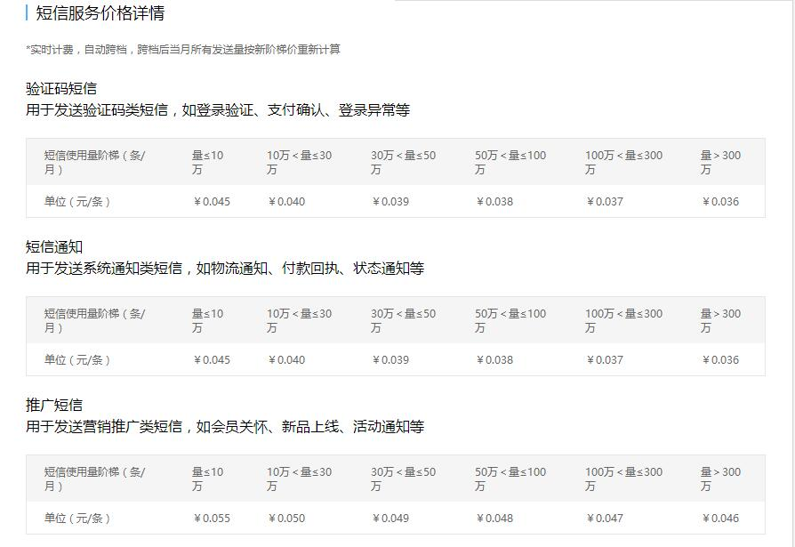

### 使用阿里云短信服务发送短信

这个仓库是利用阿里云短信服务对特定的电话号码发送短信，调用的是阿里的短信服务API。比起Twilio阿里云短信服务更具灵活性，虽然要收费但是费用很低，价格如下：

相关连接：

* [短信服务](https://www.aliyun.com/product/sms)
* [API调用](https://help.aliyun.com/document_detail/55491.html?spm=5176.sms-account.109.3.66e3621hCH9jl)

